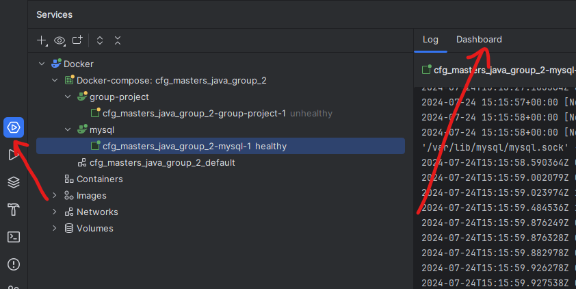

# GROUP 2 PROJECT
## Record Shop Database App

## Introduction

This project is a Spring Boot application that manages purchases and records of a music shop that sells vinyls. It utilizes JPA for database interactions and Lombok to reduce boilerplate code. The application consists of two main entities: `Purchase` and `Record`, each mapped to corresponding database tables.

The application should have the following:

| Functionality  | Description                                     |
|----------------|-------------------------------------------------|
| **Inserting**  | Add purchases to the `Purchases` table          |
| **Updating**   | Update the quantity of records after a purchase |
| **Retrieving** | Find specific record by name                    |
|                | Get list of records by artist                   |
|                | Find record by name and artist                  |


---

## Prerequisites

Before you begin, please ensure you have the following:

- Java Development Kit (JDK) 17 or higher
- The latest version of Maven
- An SQL database (e.g., MySQL)
- IntelliJ Community / Ultimate

---

## Setup Instructions

1. **Clone the repository**.


2. **Ensure the proper dependencies are installed. Please refer to `pom.xml` in the file for your reference**
    - Spring Boot 
    - Spring Web
    - Spring Data JPA
    - My SQL Driver 
    - Flyway Core 
    - Flyway MySQL
    - MySQl Connector Java
    - Lombok
    - Spring Boot Test
    - Flyway Maven
    - Open AI 
    - Rest Assured 


3. **Ensure the proper plugins are installed. Please refer to `pom.xml` in the file for your reference**
    - Jacoco
    - Maven Surefire Plugin
    - Springboot Maven plugin 


4. **Configure the database**:
    - Go to your IntelliJ configuration
    - Navigate to [GroupProjectApplication](src/test/java/com/example/group/project/GroupProjectApplicationTests.java), and edit the configuration to add in a new environment variable `MYSQL_ROOT_PASSWORD` and set it to your password for your database. For example `MYSQL_ROOT_PASSWORD="your password"`
    - Navigate to [GroupProjectApplicationTests](src/test/java/com/example/group/project/GroupProjectApplicationTests.java) and add in a new environment variable "MY_SQL_PASSWORD" and set it to your password for your database. For example `MYSQL_ROOT_PASSWORD="your password"`
    - Then run [GroupProjectApplication](src/main/java/com/example/group/project/GroupProjectApplication.java)
    - The Flyway integration should automatically create the database and migrate the relevant files to create and populate the tables.


5. **Debugging:**
    - Should you have any issue with the Flyway integration, you can manually deploy the MySQL by running the MySQL script includes in resources/db/migration 
    - Please add the following lines of codes at the start before running:

``` 
CREATE DATABASE IF NOT EXISTS recordShop;
USE recordShop;
```

---

## How to Run the Application

1. **Start the application**:
    In the project's root directory, run [GroupProjectApplication](src/main/java/com/example/group/project/GroupProjectApplication.java)

2. **API Endpoints**:

    Once the application is running, you can access the following endpoints:

    | Endpoint URL                                                     | Method | Description                                                                                                                                                        | Example Request                                                           |
    |------------------------------------------------------------------|--------|--------------------------------------------------------------------------------------------------------------------------------------------------------------------|---------------------------------------------------------------------------|
    | `http://localhost:8080/purchase`                                 | POST   | Endpoint to make a purchase. It requires a JSON body. <br><br>**Please note:** Discount is optional, and the customer field must contain more than two characters. | ```{"customer": "John",```<br>```"id": 3,```<br>```"discount": "CFG" }``` |
    | `http://localhost:8080/records?artist={ARTISTNAME}&name={ALBUM}` | GET    | Endpoint to retrieve the information on a specific artist. It takes artist ('artist') and album name ('name') as parameters.                                       | http://localhost:8080/getRecord?artist=Michael%20Jackson&name=Thriller    |

---

### API Spec:

This will help in generating interactive API documentation in order to test the API calls. Please see Open API: [here](http://localhost:8080/swagger-ui/index.html).

### Documentation:

Located [here](https://github.com/Tookles/cfg_mastersplus_java_group_two/tree/main/documentation)

---

## Docker Instructions:

To follow these instructions you have to have Docker Desktop installed on your machine.

1. Start docker engine by opening Docker Desktop (or start it from IntelliJ)
2. Building the containers
3. (MAC users only) In the terminal run the command `MYSQL_ROOT_PASSWORD=yourMySQLpassword docker compose up --build` using your own password instead of "yourMySQLpassword".
   b. (WINDOWS users only) In the terminal run the command `docker compose up --build`.
4. (WINDOWS users surely, MAC users if needed) Insert your MySQL root password in the environment variables
   As showed in the image , click on the Services to see your docker containers, select the mysql container and click on Dashboard.
5. Insert your personal MySQL password for the MYSQL_ROOT_PASSWORD variable
6. Check if the app is running by visiting http://localhost:8080/records. You should see the list of records from the database. 

---

### Further development: 

- Use JSON Web Tokens and encryption when sending calls to the `/purchase` endpoint to ensure security 


### Developers + Github profiles:

- [Rachel](https://github.com/Tookles)
- [Fabiola](https://github.com/Fabi-P)
- [Alyssa](https://github.com/lyscodes)

---
### Notes to the Marker:

Annotations were not set up in this code as it was not utilised. (Rachel and Fabi, please check this.)
